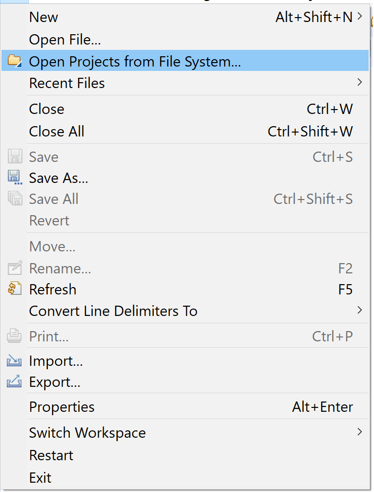
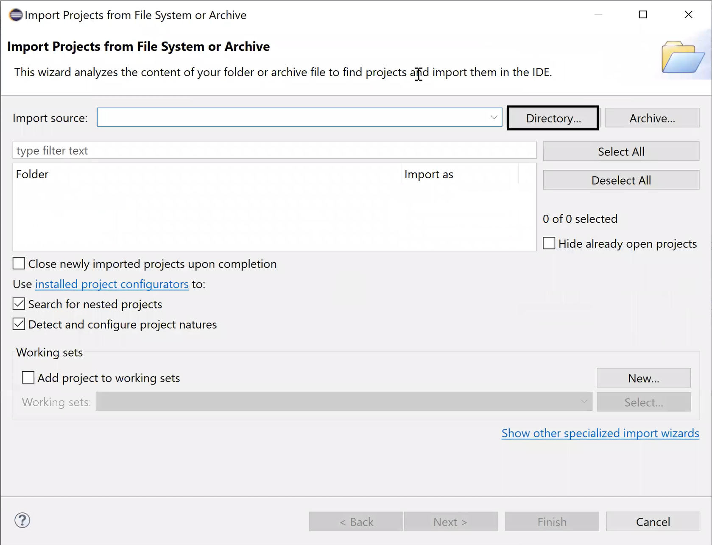
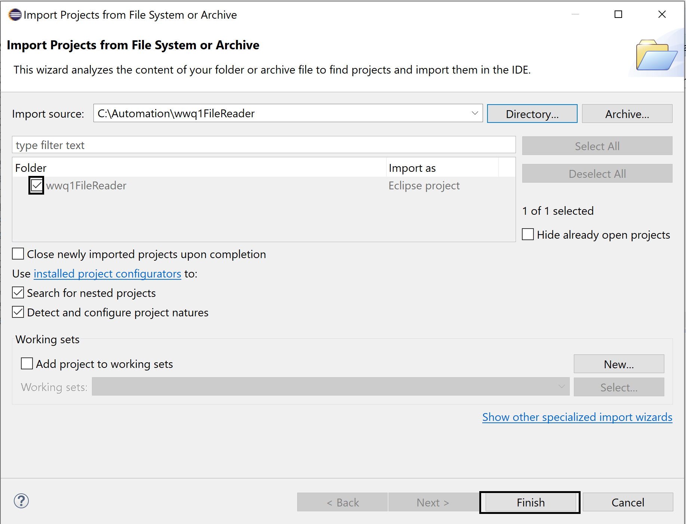
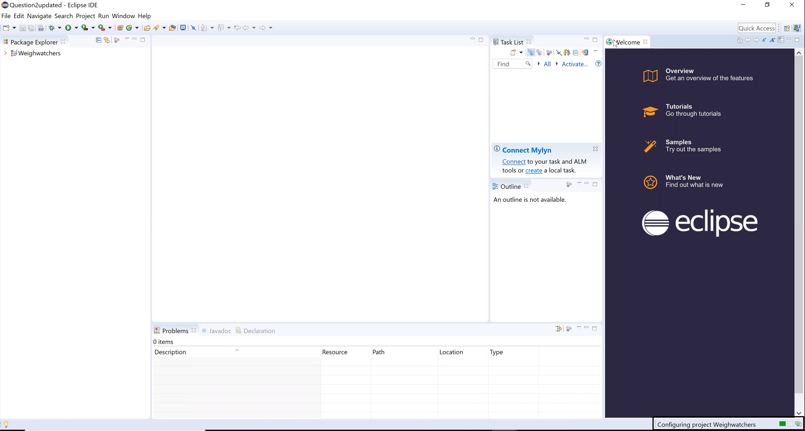
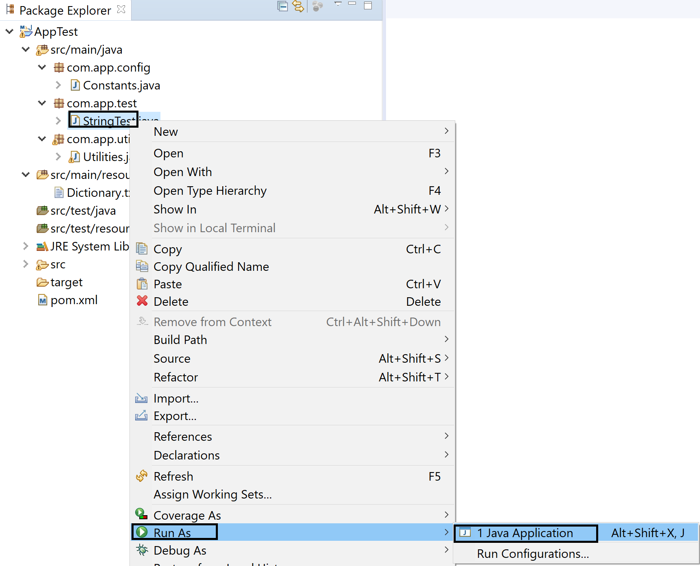
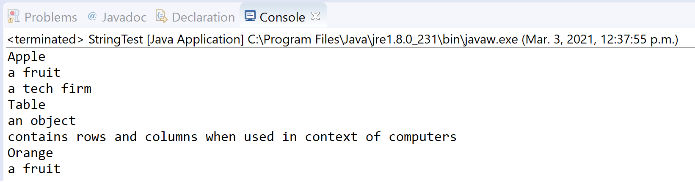

# How to Setup & Run the project:-
These are ways:

* Step 1: Download the code from repository and import in the eclipse. File->Open Projects from File System

 

* Step 2: Click on Directory and Navigate to source code folder you have dowloaded. Select the Folder & Click on Select Folder Button

 

* Step 3: Click on checkbox and click on Finish button

 

* Step 4: Wait for the dependencies to be loaded

 

* Step 5: Run test as Java Application Right Click StringTest.java->Run As-> Java Application

 

* Step 6: You will notice in Eclipse Console output 

 

